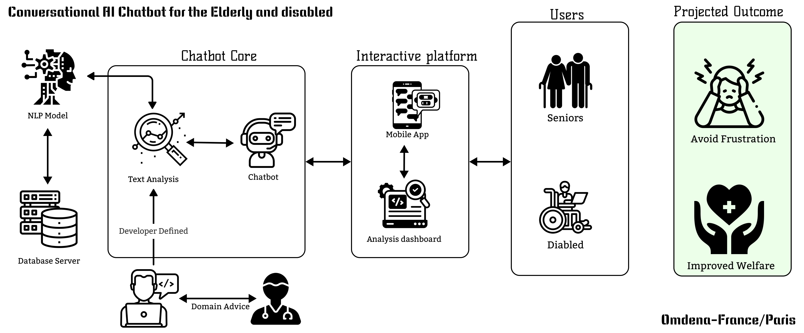

# Omdena Paris and France Chapter-project-repository 

# [Conversational AI Chatbot for the Elderly and Disabled using NLP]

 
## Contribution Guidelines
- Project Managment Page [project structure](https://www.notion.so/omdenadocs/Paris-France-Chapters-Conversational-AI-Chatbot-for-the-Elderly-and-Disabled-PROJECT-MANAGEMEN-d652350b35fb4d11aa1478731acac2f2)  
- If you're creating a task, Go to the task folder and create a new folder with the below naming convention and add a README.md with task details and goals to help other contributors understand
    - Task Folder Naming Convention : _task-n-taskname.(n is the task number)_  ex: task-1-data-analysis, task-2-model-deployment etc.
    - Create a README.md with a table containing information table about all contributions for the task.
- If you're contributing for a task, please make sure to store in relavant location and update the README.md information table with your contribution details.
- Make sure your File names(jupyter notebooks, python files, data sheet file names etc) has proper naming to help others in easily identifing them.
- Please restrict yourself from creating unnessesary folders other than in 'tasks' folder (as above mentioned naming convention) to avoid confusion. 

## Project Structure

    ├── LICENSE     <- The top-level 
    ├── README.md   <- The top-level README for developers/collaborators using this project.
    ├── original    <- Original Source Code of the challenge hosted by omdena.  
    │__ Dataset
    │
    ├── AnnoMI      <- Folder containing annoMI dataset prepared for dialoGPT
    │ 
    │   
    ├── src  <- Source code folder for individual tasks in this project
        │
        ├── task_1    <- Data exploration analysis
        │   
        ├── task_2    <- Model experiments and evaluation
        │
        ├── task_3    <- Model improvements and selection
        │
        ├── task_4    <- Master folder for all individual task folders
        │
        └── *.png*    <- Chatbot deployment.
--------

